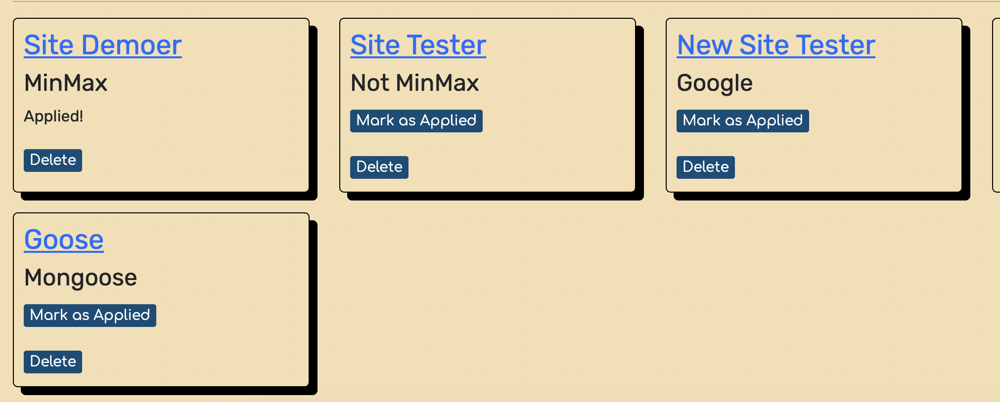
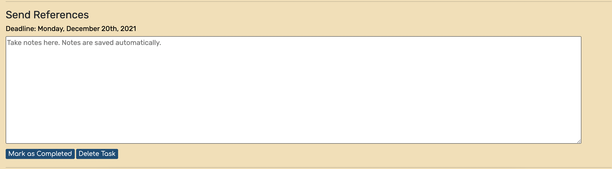
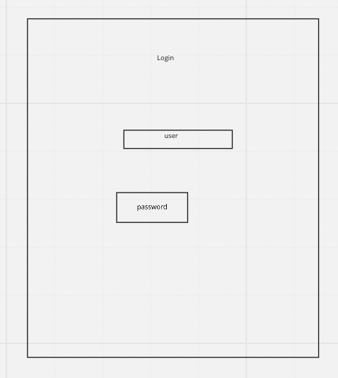
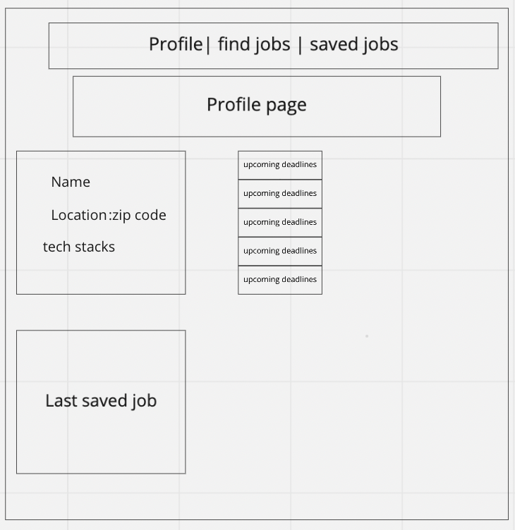
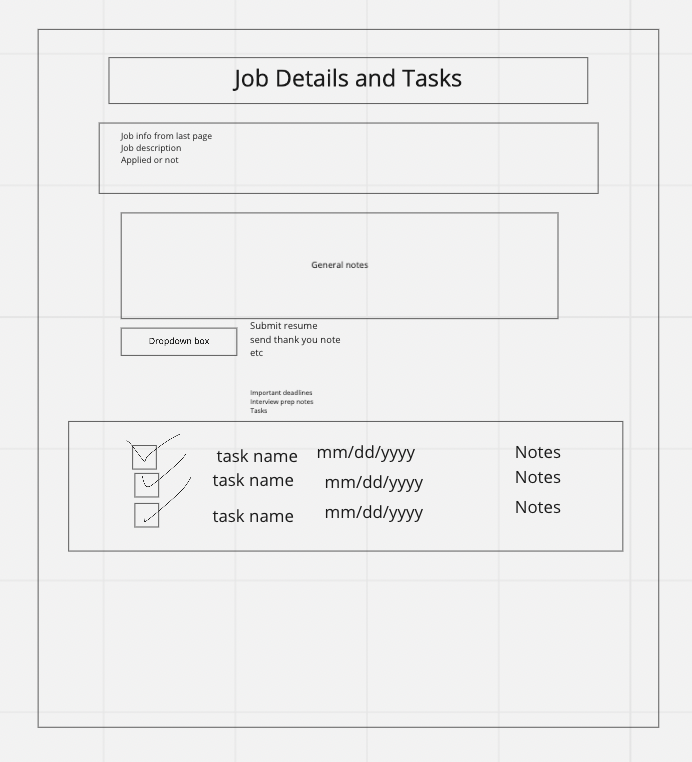
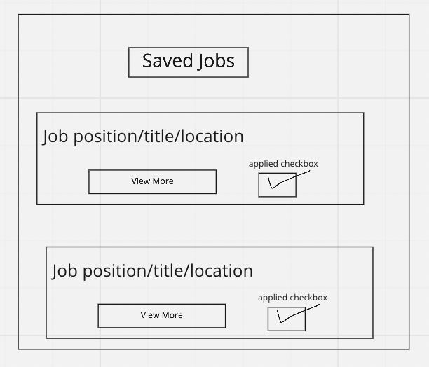

# Job Hunter
Job Hunter is an app designed to help recent tech grads organize their job search process. The app will have a page for the users profile, job listings, saved jobs, and details/task list. 

[API Github](https://github.com/devinrbopp/job-hunting-journal-api)
[Heroku](https://minmax-job-hunter.herokuapp.com/)

## Profile
The profile page displays the user's name, skills, and zipcode. 

## Job Page
The job page will have a form the user can fill out to save information about a job that they are in the process of applying to. 

## Job Details
The details page will display extra details about the job. There will also be a general notes entry field for the user to write anything they need to remember about the job, such as interview prep notes or their opinions on the company. There is also a dropdown box that allows the user to choose from a list of tasks to display. The user can enter a deadline as well as mark their tasks as completed. 

## General Approach
A huge portion of this program was mob programmed. We decided that this was the best approach due to most of our pages depending on aspects of other pages to work. We pair programmed the components of our app that were more independent, such as the forms. We decided to start with pair programming the profile and jobs page first, as those two pages had the least overlapping needs. After those two pages were complete we pair programmed parts of Jobs.js and Tasks.js. Once the independent parts were complete, we mob programmed the rest of the app so that all of us would know exactly what's going on and could see how all the inner parts connected.

## Tech Stack
This app was created with the MERN stack. MERN stands for MongoDB, Express, React, and Node. 

- MongoDB is NoSQL database program. It is a non-relational database, meaning it does not use tables, allowing for a more agile and flexible manipulation of data. 

- Expres is a NodeJS framework that provides a myriad of methods and middleware to communicate with the database. 

- React is a framework/library used to create an interactive user interface. It updates and renders the pages as the data and code change. 

- Node is an asynchronus event-driven runtime environment. It allows us to run JavaScript on a server, tying the frontend and backend together. 

## User Stories
As a tech job hunter, I want to…
- Save jobs that I am interested in
- Track tasks and deadlines pertaining to individual job listings
- See the five upcoming deadlines on my profile page
- Draft answers to frequently asked interview questions so I can prepare for interviews

## Wireframes
### Login

### Profile

### Saved Jobs

### Job Details/Tasks

## Obstacles
- Curly brackets
- Differentiating between needing a subdocument as opposed to a full document
- Adapting to workflow of a group git project
- Ensuring that the proper data sets were deleted through our fetch requests